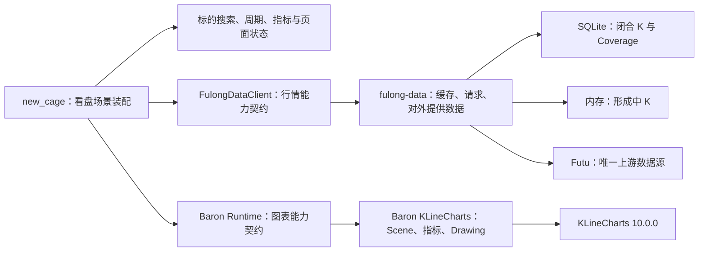

# KLineChart Pro 与 Baron KLineCharts 对比及接入说明

## 1. 结论

KLineChart Pro 与 Baron KLineCharts 不是同一层级的产品，不能按“二选一的同类图表库”理解：

- **KLineChart Pro** 是基于 KLineChart 组装的开箱即用看盘前端，重点解决标的搜索、周期切换、指标选择、图表设置和实时数据接入等产品交互问题。
- **Baron KLineCharts** 是基于 KLineCharts 10.0.0 的受控图表场景平台，重点解决场景契约、Drawing、跨周期投影、跨语言处理、离线 HTML/PNG 渲染和结果可复现问题。

本项目采用以下决策：

1. 不使用 KLineChart Pro 替换 Baron KLineCharts。
2. 不让 KLineChart Pro 与 Baron Runtime 同时控制同一个 KLineCharts 图表实例。
3. 参考 KLineChart Pro 的看盘页面结构和 `Datafeed` 契约，但不接入其默认 Polygon/Massive 数据源。
4. 由 `new_cage` 承担看盘页面、状态编排和 `fulong-data` 适配。
5. Baron KLineCharts 继续作为图表渲染、指标、Drawing、跨周期画线和场景资产能力。
6. `fulong-data` 是金融行情数据的唯一服务入口，Baron KLineCharts 不直接访问 Futu 或其他上游数据源。

## 2. 两个项目分别解决什么问题

### 2.1 KLineChart Pro

KLineChart Pro 的官方定位是“基于 KLineChart 的开箱即用金融图表”。它在 KLineChart 图表引擎之上提供一套现成看盘界面，并通过 `Datafeed` 获取行情。

当前公开代码中，KLineChart Pro 已提供：

- 标的搜索弹窗。
- 周期选择栏。
- 主图、副图指标选择和指标参数设置。
- 时区和图表设置。
- 截图功能。
- 画线工具栏。
- 历史 K 线加载。
- 实时行情订阅和退订。

它的主要目标是让接入方快速得到一个可以使用的金融看盘页面，而不是定义可跨语言流转的图表资产。

官方资料：

- [KLineChart Pro 仓库](https://github.com/klinecharts/pro)
- [KLineChart Pro 类型定义](https://github.com/klinecharts/pro/blob/main/src/types.ts)
- [KLineChart Pro UI 组件](https://github.com/klinecharts/pro/tree/main/src/widget)
- [KLineChart Pro package.json](https://github.com/klinecharts/pro/blob/main/package.json)

### 2.2 Baron KLineCharts

Baron KLineCharts 的输入和输出核心是版本化 `ChartScene`、`DrawingDocument` 和 `DrawableWorkspaceDocument`。图表不仅用于页面展示，还能在 Web、CLI、Python、自包含 HTML 和 PNG 之间流转。

当前项目已经提供：

- 严格的 JSON Schema 和语义校验。
- RFC 8785 规范序列化和 SHA-256 场景指纹。
- 对 KLineCharts 10.0.0 的唯一受控适配边界。
- K 线和通用时间序列场景。
- 指标增删与主序列展示切换。
- 22 种 Drawing 及其样式编辑。
- Drawing 独立文档、稳定 ID、`scopeKey` 和宿主确认式持久化。
- 同标的跨周期 Drawing 投影和周期 Scene 替换。
- 向前加载更早历史行情的宿主端口。
- Web Runtime、CLI、Python、离线 HTML 和固定 Chromium PNG 渲染。
- 跨语言、浏览器、视觉基线和安装验证。

Baron KLineCharts 刻意不持有网络数据源，不负责标的搜索，也不理解 `fulong-data` 或 Futu。

## 3. 能力对比

| 对比项 | KLineChart Pro | Baron KLineCharts |
| --- | --- | --- |
| 核心定位 | 开箱即用的金融看盘前端 | 受控、可序列化的图表场景平台 |
| KLineCharts 依赖 | `klinecharts >= 9.0.0` | 精确锁定 `klinecharts = 10.0.0` |
| 当前项目版本 | `0.1.1` | `0.9.7` |
| 标的搜索 UI | 已提供 | 未提供 |
| 周期选择 UI | 已提供 | 未提供成品周期栏 |
| 周期切换能力 | 内部切换并重新加载数据 | 宿主加载完整 Scene 后原子替换 |
| 初始历史 K 请求 | `Datafeed.getHistoryKLineData` | 宿主请求后构造完整 `ChartScene` |
| 向前加载历史 K | 由 Datafeed 和图表内部协作 | 已提供请求、提交和拒绝端口 |
| 形成中 K 增量更新 | `Datafeed.subscribe` | 当前公共 Runtime API 缺失 |
| 实时退订 | `Datafeed.unsubscribe` | 当前不负责行情订阅 |
| 历史与实时协调 | Pro 内部完成 | 应由 `new_cage` 场景装配职责完成 |
| 指标能力 | 带现成选择和设置界面 | 有指标能力，没有完整指标产品 UI |
| Drawing | 面向看盘交互 | 面向正式业务数据和可持久化资产 |
| 跨周期 Drawing | 未提供独立业务契约 | 已提供跨周期投影与持久化协调器 |
| 场景导入导出 | 不是核心能力 | 核心能力 |
| 跨语言 | 浏览器 TypeScript | Web、CLI、Python |
| 离线渲染 | 不是核心能力 | 自包含 HTML 和固定环境 PNG |
| 结果可复现 | 不是核心目标 | 严格契约、规范序列化、哈希和视觉基线 |
| UI 技术 | 内部使用 SolidJS | Runtime 不绑定业务 UI 框架 |
| 默认数据源 | Polygon/Massive，可替换 | 无数据源，且禁止 Runtime 直接请求行情 |

## 4. 数据接入契约差异

### 4.1 KLineChart Pro 的 Datafeed

KLineChart Pro 定义的数据接口如下：

```ts
interface Datafeed {
  searchSymbols(search?: string): Promise<SymbolInfo[]>

  getHistoryKLineData(
    symbol: SymbolInfo,
    period: Period,
    from: number,
    to: number
  ): Promise<KLineData[]>

  subscribe(
    symbol: SymbolInfo,
    period: Period,
    callback: (data: KLineData) => void
  ): void

  unsubscribe(
    symbol: SymbolInfo,
    period: Period
  ): void
}
```

该契约直接面向看盘产品流程：

```text
搜索标的 → 请求历史 K → 订阅形成中 K → 持续更新图表
```

Pro 自带的 `DefaultDatafeed` 直接访问 Polygon/Massive。它只是默认示例实现，不属于 KLineChart Pro 必须使用的固定数据源，本项目不得采用该实现。

### 4.2 Baron KLineCharts 的 Scene 输入

Baron KLineCharts 接收已经装配完成的 `ChartScene`：

```ts
interface ChartScene {
  symbol: Symbol
  period: Period
  data: MarketData[]
  chart: ChartConfig
  panes: ScenePane[]
  overlays: SceneOverlay[]
  viewport: Viewport
  render: Render
  metadata: JsonObject
}
```

初始数据必须由宿主获取并标准化。Runtime 不根据 `symbol` 自己发起网络请求，也不会猜测数据来源。

对于向左滚动加载更早历史数据，当前项目已经定义：

```ts
interface EngineHistoricalDataRequest {
  requestId: string
  beforeTimestamp: number
  period: Period
  dataCount: number
}
```

宿主完成请求后，通过以下能力提交结果：

```ts
commitHistoricalData(requestId, data, hasMore)
rejectHistoricalData(requestId)
```

这里不包含 `instrumentId`，因为标的已经绑定在当前 Scene 中；真正的数据请求仍由宿主结合当前标的完成。

## 5. 面向 new_cage 与 fulong-data 的职责划分

### 5.1 架构关系



依赖方向固定为：

```text
new_cage → FulongDataClient → fulong-data → Futu
new_cage → Baron Runtime → KLineCharts
```

禁止形成以下反向依赖：

- Baron KLineCharts 不依赖 `new_cage`。
- Baron KLineCharts 不依赖 `fulong-data`。
- `fulong-data` 不依赖 Baron KLineCharts 或 KLineChart Pro。
- `new_cage` 不直接请求 Futu、Polygon/Massive 或其他上游行情源。

### 5.2 new_cage 的场景装配职责

`new_cage` 同时持有 UI 绑定和业务状态，负责：

- 当前标的、周期、复权方式和交易时段模式。
- 搜索条件、加载状态、错误状态和空状态。
- 调用 `fulong-data` 的四项基础数据能力。
- 将 `fulong-data` 返回的数据显式映射为 `ChartScene` 和 `MarketData`。
- 创建、销毁或替换 Baron Runtime 的 Scene。
- 将实时形成中 K 更新提交给 Runtime。
- 在周期切换时协调 Scene 替换与 Drawing 保留。

这些状态不能下沉到 Baron KLineCharts。Baron 只处理经过验证的图表输入，不理解业务页面状态和行情缓存策略。

### 5.3 fulong-data 的数据职责

`fulong-data` 继续只提供已经确定的四项基础数据能力：

1. 标的搜索。
2. 获取历史闭合 K。
3. 获取实时形成中 K。
4. 获取历史闭合 K 与实时形成中 K。

其中：

- 闭合 K 和 Coverage 持久化在 SQLite。
- 形成中 K 保存在服务内存中，不写入闭合 K Coverage。
- 缓存不完整时由 `fulong-data` 请求 Futu 补齐。
- 对外数据语义由 `fulong-data` 定义，不由 Pro、Baron Runtime 或 `new_cage` 反向决定。

### 5.4 Baron KLineCharts 的原子能力职责

Baron KLineCharts 负责：

- 渲染 K 线和通用时间序列。
- 图表交互和指标。
- Drawing 创建、编辑、选择、删除和导出。
- DrawingDocument 与 Workspace 契约。
- 跨周期 Drawing 投影。
- Scene 校验、规范序列化和确定性输出。
- 通过纯数据端口接收宿主提供的行情。

Baron KLineCharts 不负责：

- 标的搜索。
- Futu 连接。
- HTTP、WebSocket 或轮询策略。
- SQLite、Coverage 和缓存补齐。
- 行情权限与订阅额度。
- `new_cage` 的页面状态和错误文案。

## 6. 典型协作流程

### 6.1 首次打开标的

```text
1. new_cage 调用 fulong-data 的“历史闭合 K + 实时形成中 K”。
2. fulong-data 检查 SQLite Coverage 和闭合 K 缓存。
3. 缓存不完整时，fulong-data 从 Futu 补齐闭合 K。
4. fulong-data 从内存或 Futu 获取当前形成中 K。
5. fulong-data 分别返回历史闭合 K 和实时形成中 K。
6. new_cage 显式映射字段并装配 ChartScene。
7. new_cage 创建 Baron Runtime 并展示图表。
```

### 6.2 向左加载更早历史 K

```text
1. Baron Runtime 发出 historical-data-requested。
2. 事件包含 beforeTimestamp、period 和 dataCount。
3. new_cage 补充当前 instrumentId、adjustment 和 sessionMode。
4. new_cage 调用 fulong-data 的“获取历史闭合 K”。
5. 请求成功后调用 commitHistoricalData(requestId, data, hasMore)。
6. 请求失败后调用 rejectHistoricalData(requestId, message)。
```

### 6.3 实时形成中 K 更新

```text
1. new_cage 通过 FulongDataClient 获取实时形成中 K。
2. new_cage 将服务字段映射为 Baron MarketData。
3. new_cage 调用待新增的 Runtime 实时 K 增量更新能力。
4. Runtime 按 timestamp 更新最后一根 K，或在新区间追加新 K。
5. Drawing、viewport 和其他 Scene 状态保持不变。
```

### 6.4 周期切换

```text
1. 用户在 new_cage 选择新周期。
2. new_cage 请求该周期的“历史闭合 K + 实时形成中 K”。
3. new_cage 组装新周期完整 Scene。
4. CrossPeriodDrawingCoordinator 调用 replaceScene。
5. 图表行情和周期被替换，已确认 DrawingDocument 保持不变。
```

## 7. Baron KLineCharts 当前需要补齐的能力

为了完整接入 `fulong-data`，Baron KLineCharts 当前只缺少一个关键类别：**实时形成中 K 的增量更新端口**。

建议对外能力暂定为：

```ts
upsertRealtimeBar(bar: MarketData): RealtimeBarUpdateResult
```

该能力应满足：

- `bar.timestamp` 等于当前最后一根 K 时，只替换最后一根。
- `bar.timestamp` 大于当前最后一根 K 时，只追加新的一根。
- 拒绝早于当前最后一根 K 的乱序实时更新。
- 不因实时更新重置 viewport、Drawing、指标或选择状态。
- 不在 Runtime 内部发起网络请求。
- 不在 Runtime 内部判断 Coverage。
- 不把缺失业务字段用其他字段推算补齐。
- 输入仍通过 Scene Schema 对应的 `MarketData` 语义校验。

接口最终命名、返回字段、形成中状态是否进入 `exportScene()`，需要在实现该能力时单独收敛；本说明不提前扩大 Scene 契约。

除此之外，标的搜索、周期工具栏、订阅生命周期和请求状态应实现于 `new_cage`，不应继续下沉到 Baron KLineCharts。

## 8. KLineChart Pro 的采用边界

允许参考或借鉴：

- 页面级标的搜索交互。
- 周期选择和指标设置的信息架构。
- `Datafeed` 的职责拆分思想。
- 历史加载与实时订阅的生命周期组织。
- 空状态、加载状态和图表设置入口。

不采用：

- `DefaultDatafeed` 的 Polygon/Massive 实现。
- Pro 对 KLineCharts 图表实例的直接控制方式。
- Pro 内部的数据字段作为 `fulong-data` 对外契约来源。
- Pro 与 Baron Runtime 在同一张图表上的双重包装。
- 为迁就 Pro 而破坏 Baron Scene、DrawingDocument 或 Workspace 契约。

## 9. 最终落地判断

如果完全采用 KLineChart Pro，可以较快获得一个普通看盘页面，但会失去或重新实现 Baron KLineCharts 已经具备的场景序列化、跨语言处理、离线渲染、确定性输出、DrawingDocument 和跨周期 Drawing 等能力。

因此，本项目的合理路线不是替换，而是补齐职责：

```text
参考 Pro 的产品交互与 Datafeed 思想
                    ↓
new_cage 实现看盘场景装配和 FulongDataClient
                    ↓
Baron KLineCharts 增加最小实时 K 增量端口
                    ↓
fulong-data 独立负责行情缓存、补齐和 Futu 接入
```

这一结构可以复用 Baron KLineCharts 已有投入，同时保持 `fulong-data` 的数据语义独立，不让前端图表组件反向定义数据服务边界。
