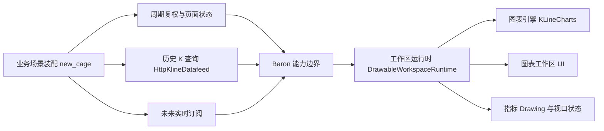

# Baron KLineChart Pro 能力对齐技术方案

> 文档优先级：本方案与根目录 `AGENTS.md` 共同作为本轮能力对齐和开发顺序的有效口径。同目录早期对比材料如在数据底座名称、工程版本或实时演进顺序上与本方案冲突，以 `AGENTS.md` 和本方案为准。

## 1. 要做的事与技术背景

本章结论：本期推荐直接在 Baron KLineCharts 的历史 K 基线上完成 KLineChart Pro 风格的产品能力对齐，不等待 `new_cage` 的历史 K 与实时 K 端到端合并完成。开发前只固化实时兼容的设计护栏，不提前确定实时 K 的具体 Runtime API；后续实时接入应成为新增的数据投送方式，而不是推翻本期 UI、指标和状态设计。

### 1.1 业务目标

当前 Baron KLineCharts 已经具备严格 Scene、Drawing、跨周期和历史补页能力，但标准工具栏仍以横向复合工具条为主，与 KLineChart Pro 的看盘工作区存在明显产品差异。本期目标是补齐以下能力：

- 将绘图工具迁移到左侧并按用途归类。
- 将 1 小时、2 小时、日 K、周 K 周期入口放到顶部。
- 提供主图指标选择入口，首期不建设动态副图生命周期。
- 将时区、价格轴、主序列和前复权归入清晰的顶部入口与设置入口。
- 增加作用于完整图表工作区的全屏能力。
- 暂不实现截图，不以完整实时 K 链路作为本期前置条件。

### 1.2 当前现状

Baron 的标准工具栏当前同时装配绘图工具、价格轴、主序列、导出和宿主动作，入口集中在 `packages/web-runtime/src/toolbar/standard-toolbar.ts:260`。绘图工具已经在 `packages/web-runtime/src/toolbar/toolbar-tools.ts` 中形成语义分组，具备拆分为左侧工具栏的基础。

历史 K 方面，Baron 已经形成三段宿主投送能力：空 Runtime 通过 `packages/web-runtime/src/drawing/progressive-workspace-runtime.ts:183` 安装首次历史 Scene；Workspace 通过 `packages/web-runtime/src/drawing/capabilities.ts:64` 接收向前补入的历史数据；跨周期协调器通过 `packages/web-runtime/src/cross-period/coordinator.ts:276` 请求宿主装配新周期 Scene 并完成替换。Baron 不负责行情网络请求。

`new_cage` 已经实现历史 K 薄 Datafeed。`/Users/yebingyue/code/baron/new_cage/web/src/shared/kline-datafeed.ts:72` 定义了只包含 `queryHistory` 的历史接口，支持时间范围、周期、复权、取消和响应身份校验；`/Users/yebingyue/code/baron/new_cage/web/src/main.ts:4401` 负责首次查询并安装 Scene；同文件 `:4812` 和 `:5046` 已经完成跨周期重新取数与 Scene 替换；`:4972` 已完成向左加载更早历史 K。

实时 K 方面，`new_cage` 已有服务端 WebSocket 和浏览器侧 Overlay 状态模型，但尚未完成页面主链路集成。当前服务端入口 `/Users/yebingyue/code/baron/new_cage/src/cage_service/api.py:595` 只开放 CRYPTO、1 小时和不复权；浏览器 `/Users/yebingyue/code/baron/new_cage/web/src/shared/live-bar-overlay.ts:84` 已能区分形成中、窗口已结束和历史确认，但 Baron 公共 Workspace Runtime 尚未提供与实时更新频率匹配的增量能力。

### 1.3 核心冲突

第一个冲突是交付顺序。如果等待实时 K 完整合并后再做产品能力对齐，工具栏、指标、时区和全屏会被一个更大的数据生命周期工程阻塞；但如果完全按历史 K 封闭设计，又可能在实时接入时发现指标状态、Scene 替换和形成中 K 的语义无法兼容。

第二个冲突是状态混合。历史 K 是已确认的行情事实，形成中 K 是随消息不断变化的临时投影，指标与 Drawing 则是图表交互状态。若三者都通过完整 Scene 高频替换，容易造成不必要的全量校验和复制，也可能丢失视口、指标或 Drawing 状态。

第三个冲突是职责下沉。Baron 可以提供可复用的顶部栏和能力入口，但标的、周期、复权、历史请求、未来实时订阅与重连均属于 `new_cage` 场景装配职责，不能因为迁移 Pro UI 就把网络数据源带入 Baron。

### 1.4 本次改造范围

本期覆盖 Baron 的工作区 UI 分层、主图指标、时区展示切换、设置归类、完整工作区全屏，以及与 `new_cage` 现有历史 K 链路的兼容接入。方案同时定义未来实时 K 不得破坏的边界，但不设计实时 K 的具体公共接口。

### 1.5 非目标范围

- 不实现 WebSocket 订阅、退订、重连或最终化协调。
- 不扩展实时 K 到更多市场、周期或复权口径。
- 不提前确定实时 K 的方法名、事件名、消息结构或导出格式。
- 不实现动态副图创建、删除和副图布局管理。
- 不实现截图。
- 不在服务端计算 KLineCharts 内置技术指标。
- 不让 Baron 直接访问 `fxxking-data` 或任何上游行情源。

## 2. 总体技术方案描述

本章结论：采用“设计护栏先行、历史基线开发、实时能力后接”的顺序。`new_cage` 继续承担行情与业务场景装配，Baron 负责规范数据接收、指标计算、Drawing、渲染和可复用图表工作区 UI；本期只要求任何新增能力不阻断未来实时投影，不要求现在给出完整实时契约。

### 2.1 方案总览

本方案不选择“先完成历史与实时合并，再开始 UI 对齐”。实时 K 当前涉及订阅身份、市场能力、复权限制、乱序消息、断线重连、形成中状态、最终化和历史确认，完成端到端链路的范围显著大于本期 UI 目标。等待该链路会延迟绝大多数与实时无关的产品能力，也会让实时实现继续依赖当前尚未拆分的工具栏和 Runtime 状态。

本方案也不选择“完全忽略实时，按纯历史页面封闭实现”。本期所有 Runtime 和 UI 设计必须遵守根目录 `AGENTS.md` 的实时兼容约束：已确认历史事实、未来形成中投影与用户交互状态保持概念分离；不得要求未来每次实时消息都重建完整 Runtime 或整体替换 Scene；指标配置不得与历史查询生命周期绑定。



图说明：`new_cage` 是场景装配方，持有网络副作用和业务身份；Baron 只暴露稳定能力边界。历史 K 是本期真实输入，未来实时订阅与历史查询从同一宿主方向进入 Baron，但两者不要求现在使用相同的具体协议。工具栏、指标、Drawing 和视口均位于网络数据源之下，不反向依赖 HTTP 或 WebSocket。

### 2.2 职责与依赖方向

`new_cage` 继续负责当前标的、周期、复权、时间范围、历史请求和响应身份校验。未来接入实时 K 时，它还负责订阅建立、切换、取消、重连和最终化后的历史确认。所有金融市场数据请求必须通过 `fxxking-data`，Baron 不感知具体服务路径、鉴权方式或上游来源。

Baron 的能力边界负责接收已经规范化的 OHLCV、维护 Workspace 状态并驱动 KLineCharts。Baron 可以提供周期和复权入口，但这些入口只表达用户意图并展示宿主注入的可用态、加载态和失败态，不自行请求数据。

Baron 的原子能力负责指标计算、图表绘制、Drawing、视口、工具栏组件和全屏交互。主图指标直接基于 Runtime 当前有效 K 线序列计算；数据是历史快照还是未来实时投影，不应改变指标入口和配置模型。

依赖方向固定为：

```text
new_cage 场景装配 → Baron 能力边界 → Baron Runtime → KLineCharts
new_cage 场景装配 → fxxking-data → 规范历史或实时行情
```

不得形成 Baron 依赖 `new_cage` 业务类型、API 路径或 `fxxking-data` 客户端的反向依赖。

### 2.3 状态所有权

| 状态或行为                        | 所有者                                     | 本期口径                                         |
| --------------------------------- | ------------------------------------------ | ------------------------------------------------ |
| 标的、市场、周期、复权和时间范围  | `new_cage`                                 | Baron 只接收映射后的 Scene 和宿主意图状态        |
| 历史 K 查询、鉴权、取消和错误处理 | `new_cage`                                 | 复用现有 `HttpKlineDatafeed` 与后端接口          |
| 已确认历史 K                      | 行情服务提供事实，Baron 维护当前投影       | 首次安装、跨周期替换和历史补页继续使用现有链路   |
| 形成中实时 K                      | 未来由 `new_cage` 投送，Baron 临时投影     | 本期只规定不能与权威历史事实混为同一生命周期     |
| 主图指标与参数                    | Baron Runtime                              | 在浏览器计算，并在数据更新后基于当前有效序列重算 |
| DrawingDocument                   | Baron 契约与宿主持久化共同维护             | 周期切换保留；复权切换继续尊重不同价格坐标作用域 |
| 视口、时区和展示设置              | Baron Runtime 持有当前态，宿主可持久化偏好 | 不依赖历史或实时运输方式                         |
| 订阅、重连和最终化协调            | `new_cage`                                 | 非本期范围                                       |

### 2.4 为什么只约束实时兼容，不提前给定具体契约

当前实时链路只覆盖有限市场和周期，页面主链路尚未真正消费 `LiveBarOverlayState`。此时直接确定公共 Runtime 接口，会把试验阶段的 `barStart`、`windowState`、`barFinalized` 或特定市场限制过早提升为 Baron 通用语义。

本期只固定不会轻易变化的原则：历史事实与临时投影分离；高频更新不整体替换 Scene；指标、Drawing 和视口不因更新丢失；网络与重连留在宿主。等实时主链路真实接通后，再根据更新、最终化、回补和导出的完整行为决定公共契约，可以减少错误抽象。

### 2.5 周期与复权不能机械合并

周期切换发生在同一标的和同一价格口径内。`new_cage` 当前通过跨周期协调器重新获取目标周期历史 K，装配 Scene 后替换行情分支，同时验证 DrawingDocument 未变化。该链路可以继续复用。

复权切换会改变价格坐标，并且 `new_cage` 当前分别使用 `None` 和 `qfq` DrawingDocument 作用域。因此本期只移动和归类复权设置入口，不要求复权切换改成与周期完全相同的 Scene 替换过程。宿主继续根据 Drawing 和价格坐标语义决定重建范围。

### 2.6 工具栏与产品 UI 边界

Baron 负责提供可复用的图表工作区组件：顶部行情栏、左侧绘图栏、选中 Drawing 浮动栏、指标入口、设置入口和全屏入口。组件只理解图表能力与宿主意图，不理解 `new_cage` 页面导航、观察标的、复盘侧栏或 API 错误结构。

顶部行情栏首期包含周期、主图指标、时区、设置和全屏。设置入口首期归入前复权、价格轴和主序列；其中价格轴和主序列由 Runtime 直接处理，前复权继续作为宿主动作。截图和副图指标不进入首期。

左侧工具栏复用现有绘图工具注册和语义分组，不复制 KLineChart Pro 的 SolidJS 页面代码。标准工具栏应演进为可组合工作区 UI，避免把所有入口继续集中在单一横向容器中。

### 2.7 主图指标口径

首期主图指标建议限定为 MA、EMA、SMA、BOLL、SAR 和 BBI。指标由浏览器 KLineCharts 基于当前 OHLCV 序列计算，`new_cage` 和后端不返回计算结果。

Baron 需要补齐 Workspace Runtime 的主图指标增删能力，并保证以下语义：

- 历史 Scene 首次安装后可以添加和移除指标。
- 向前补入历史 K 后，指标基于完整有效序列重新计算。
- 周期 Scene 替换后，当前会话中的指标选择按明确规则恢复。
- 未来形成中 K 更新后，指标可以重算，但本期不规定实时更新接口。
- 指标状态不得因为工具栏位置变化或数据运输方式变化而丢失。

### 2.8 `new_cage` 接入影响

历史 K 后端接口不需要修改。现有接口已经携带标的、时间范围、周期和复权口径，并由 `new_cage` 完成响应身份校验和 Scene 构造。

本期 `new_cage` 的配合仅限 Web 前端：升级 Baron 包；将旧标准工具栏挂载调整为新的顶部栏和左侧栏；继续把周期入口映射到现有周期切换流程，把前复权入口映射到现有复权切换流程；处理原有时区入口与 Baron 新入口的去重；为全屏提供包含顶部栏、左侧栏和图表的工作区根容器。

公开宿主动作和状态注入应尽量向后兼容。如果工具栏内部调整能够保持当前 actionId 与状态更新方式，`new_cage` 的历史 K 数据链路无需改动。

### 2.9 失败与降级口径

- 目标周期历史 K 获取失败时，继续显示原周期 Scene 和原有指标、Drawing、视口状态。
- 复权切换失败时，保留原价格口径和对应 DrawingDocument，不展示半切换状态。
- 指标创建失败只影响目标指标，不得触发历史 K 重载或 Runtime 重建。
- 时区切换失败不得修改 K 线时间戳、Drawing 坐标或周期身份。
- 全屏失败只回退到普通布局，不影响图表数据和交互状态。
- 宿主未提供实时能力时，历史 K 模式必须完整可用，不显示伪实时状态。

### 2.10 验证口径

| 验证场景                        | 预期结果                                                                   |
| ------------------------------- | -------------------------------------------------------------------------- |
| 仅提供历史 K                    | 顶部栏、左侧栏、指标、时区、设置和全屏均可独立使用                         |
| 切换 1 小时、2 小时、日 K、周 K | 宿主重新取数，目标 Scene 原子生效，DrawingDocument 不被周期切换修改        |
| 切换不复权与前复权              | 使用对应历史 K 和 DrawingDocument 作用域，不串用价格坐标                   |
| 添加主图指标后补入更早历史 K    | 指标基于补齐后的有效序列重新计算                                           |
| 添加主图指标后切换周期          | 指标选择按定义恢复，数值基于目标周期重新计算                               |
| 宿主没有实时数据源              | 不阻塞本期功能，不要求模拟实时消息                                         |
| 未来连续更新形成中 K            | 不重建完整 Runtime，不丢失指标、Drawing 和视口；具体协议由实时专项方案定义 |
| 全屏                            | 顶部栏、左侧栏和图表作为同一工作区进入全屏                                 |

## 3. 实施过程

### 3.1 阶段一：工程约束与历史基线确认

在根目录 `AGENTS.md` 固化本方案的职责边界、历史优先顺序和实时兼容原则。后续设计评审以该文件为约束，但不得将其中原则误读为已经批准某个具体实时 API。

### 3.2 阶段二：Baron 产品能力对齐

基于历史 K 完成工具栏拆分、主图指标、时区、设置和全屏能力。该阶段同时修复主图指标在 Workspace Runtime 中的能力暴露和 Scene 替换后恢复问题，但不接入任何实时网络来源。

### 3.3 阶段三：`new_cage` 历史 K 接入验证

升级 Baron 依赖，复用当前历史 K Datafeed、周期协调器和复权切换实现，完成新工作区 UI 的挂载与端到端回归。若接入中发现 Baron 公共能力携带了 `new_cage` 特有字段，应退回通用能力边界重新设计。

### 3.4 阶段四：实时 K 专项设计与实现

在本期 UI 对齐完成后，结合 `new_cage` 已存在的 WebSocket、Overlay 状态和最终化流程，单独收敛实时 K 的公共能力。届时再决定临时投影的更新方式、最终化确认、导出语义、事件模型和失败恢复，不反向修改本期已经稳定的工具栏与指标职责。

## 4. 延后决策项

以下内容被有意延后，不构成本期阻塞：

- 实时 K 公共能力的具体方法和事件名称。
- 形成中 K 是否以及如何进入 Workspace 导出结果。
- 实时最终化后由宿主主动回查历史，还是由统一协调器驱动。
- 多市场、多周期和复权实时订阅的能力矩阵。
- 实时消息频率控制、批处理和调度策略。

延后这些决策的前提是本期严格遵守 `AGENTS.md`：不得让历史 K 实现形成无法接入增量实时投影的结构性障碍。
