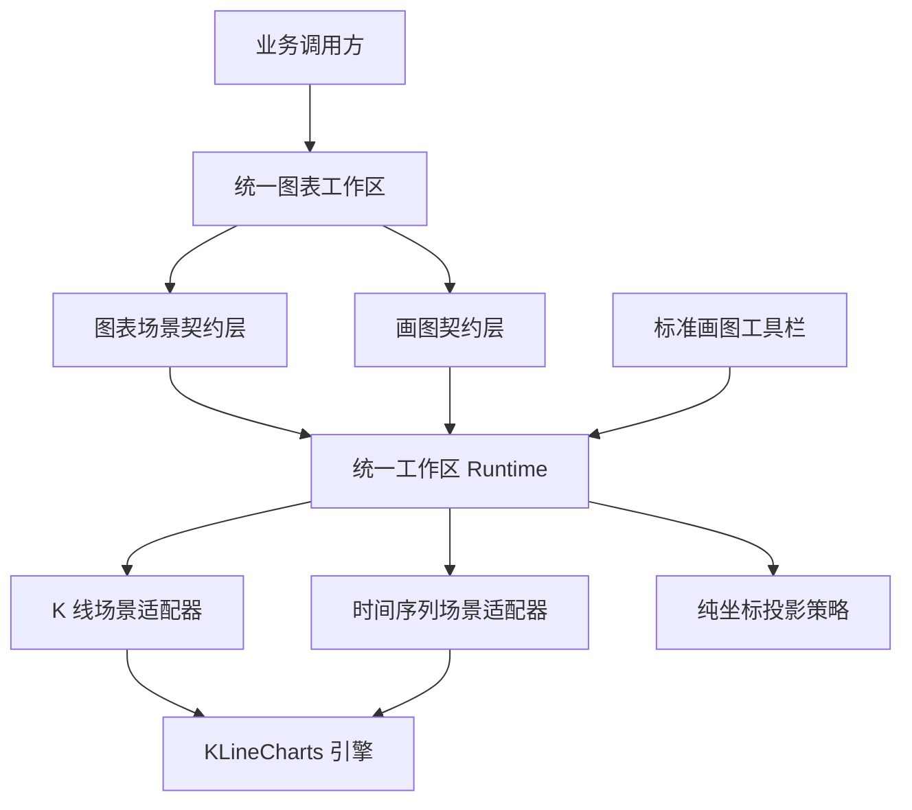

# 全图表统一画图能力技术方案

## 1. 目标与范围

- 业务目标：让 `baron-klinecharts` 当前及后续新增的全部交互式图表场景，都能使用同一套画线、标注和量度能力。业务调用方不再因为图表场景不同而选择不同工具栏、维护不同画线格式，或直接操作 KLineCharts 引擎。
- 架构目标：把画线从 `KLineSceneRuntime` 的专属能力提升为独立的 Drawing 领域能力，由通用契约、公共 Runtime 能力、场景适配器和标准工具栏共同承载。图表场景只描述被展示的数据，Drawing 文档只描述用户创建的画线事实，两者通过工作区完成确定性装配。
- 当前主要问题：
  - 仓库当前只有 `ChartScene` 和 `TimeSeriesScene` 两种顶层图表场景。
  - `ChartScene` 已通过 `KLineSceneRuntime`、`KLineChartsSceneAdapter` 和标准工具栏支持 22 种 Overlay。
  - `TimeSeriesScene` 当前仅支持折线序列展示、显隐、数据替换和十字线事件，没有 Overlay 契约、画线 Runtime 能力和工具栏入口。
  - `createStandardToolbar` 直接依赖具体的 `KLineSceneRuntime`，导致工具栏无法连接其他场景 Runtime。
  - 现有 `ChartScene.overlays` 把行情场景和画线事实放在同一份文档内，不适合作为跨周期、跨时间区间和多场景共享的唯一长期模型。
  - 现有《同标的跨周期画线设计》又定义了 `InstrumentDrawingDocument`、`InstrumentDrawing`、`ChartWorkspaceDocument` 和 `InstrumentDrawingRuntime`。如果与本方案并行实施，会产生两套 Drawing 几何、Canonical、工作区和 Runtime 权威。
- 当前图表类型边界：
  - `ChartScene` 是标准行情场景。其 `candle_solid`、`candle_stroke`、`candle_up_stroke`、`candle_down_stroke`、`ohlc`，以及本方案新增的 `area` 收盘价折线，都是同一份 OHLCV 数据的主序列展示样式，不是独立场景类型；27 种技术指标和 `candle`、`indicator` 窗格也不是独立场景类型。
  - `ChartScene` 的 `area` 严格固定读取每根 OHLCV 数据的 `close`，不能选择 open/high/low，也不能把行情转换成 `TimeSeriesScene`。KLineCharts 10.0.0 的引擎类型名为 `area`；产品语义是无面积填充的收盘价折线。
  - `TimeSeriesScene` 是通用时间序列场景，当前只允许 `line` 序列，可在同一时间轴和同一数值轴上展示一条或多条折线。
  - HTML 和 PNG 是输出形式，不属于图表类型。
- 本次方案覆盖范围：
  - `ChartScene` 与 `TimeSeriesScene` 完整支持现有 22 种画线、标注和量度工具。
  - `ChartScene` 在同一 Runtime、同一 Adapter 和同一个 KLineCharts Chart 内原子切换蜡烛/OHLC 与 `area` 收盘价折线；切换不更换 Scene kind、不重建引擎、不迁移 Drawing。
  - 建立独立于场景类型的 Drawing 文档和统一工作区。
  - 建立所有交互式图表通过统一工作区获得的公共画图能力。
  - 让标准工具栏只依赖公共画图能力，不识别具体场景类型。
  - 由现有 K 线和时间序列 Adapter 独占 KLineCharts 实例，并分别完成坐标投影、引擎 Overlay 映射和交互事件归一化。
  - 统一 Web Runtime、离线 HTML、PNG、CLI 和 Python 对 Drawing 与工作区的理解。
  - 本文档作为 Drawing 基础架构的上位规范，取代《同标的跨周期画线设计》中重复的 Drawing、Canonical、工作区和画线 Runtime 模型；跨周期文档只能保留标的范围绑定、周期切换和业务持久化等专业编排。
  - 为未来新增图表场景建立强制接入边界：正式的交互式图表类型必须让其唯一引擎 Adapter 实现公共 Drawing 端口，并提供对应的纯坐标投影策略。
- 非目标范围：
  - 不增加第二图表引擎，不在业务工程中实现 Canvas 画线或复制 `baron-klinecharts` 源码。
  - 不负责 LocalStorage、IndexedDB、数据库、远程 API、用户、权限、租户、审计和冲突合并。
  - 不请求、缓存或加工金融行情数据。
  - 不把业务标的、行业、市场或用户身份硬编码进通用 Drawing 几何契约。
  - 不将 KLineCharts Chart 实例暴露给调用方。
  - 不把同一标的的蜡烛/收盘价折线切换实现为 `ChartScene` 与 `TimeSeriesScene` 的互转、跨 `scene.kind` 替换或 Runtime 重建。
- 读者看完后应能明确：当前只有两种顶层图表场景；画线能力为什么需要从 K 线 Runtime 中抽离；Drawing、Scene、Runtime、Adapter、工具栏和业务持久化之间的职责边界；新增图表类型如何获得完整画图能力；旧 Client API 如何保持兼容。

## 2. 整体技术方案概览

### 2.1 方案总览

本方案采用“场景数据与画线事实分离、公共能力与场景适配分层”的架构。新增通用 Drawing 文档作为画线事实的权威载体，新增统一图表工作区组合具体 Scene、Drawing 文档和两者的坐标绑定。`DrawableWorkspaceRuntime` 组合具体 Scene Runtime 与公共 Drawing 会话，标准工具栏只面向 Drawing 能力和显式能力描述。现有 `KLineChartsSceneAdapter` 与 `TimeSeriesChartsAdapter` 分别继续作为各自图表中唯一的 KLineCharts 实例所有者，并实现公共 Drawing 引擎端口。

这一结构选择独立 Drawing 文档，而不是直接给 `TimeSeriesScene` 复制 `overlays` 字段，原因是画线的生命周期通常长于单次行情 Scene。K 线切换周期、时间序列切换日期范围或数据刷新时，Scene 可以替换，Drawing 文档仍保持稳定；不存在业务方从旧 Scene 手工提取并迁移 Overlay 的隐式责任。

图说明：业务方只面向正式工作区和公共 Runtime。Scene 与 Drawing 在契约层相互独立，在工作区 Runtime 中组成一次交互会话。工具栏不跨越 Runtime 访问 Adapter；纯投影策略不持有 Chart；两个现有 Adapter 分别是其 Chart 实例和全部引擎交互的唯一所有者。

### 2.2 分层设计

#### 场景契约层

场景契约层继续由 `ChartScene` 和 `TimeSeriesScene` 表达被展示的数据、周期、样式、视口和渲染参数。两种现有 Scene 的 version 和既有字段语义保持不变。`ChartScene.chart.candle.type` 以向后兼容的枚举扩展新增 `area`；旧五种取值继续通过相同 Schema 规则和编译用例，其既有文档 canonical bytes、hash 和渲染不变；生成声明只允许增加新 union 分支，不能删除或收窄旧分支。

周期结构只在 `common.schema.json` 保留一份 Schema 权威，但公共类型名不得因此合并或改名。生成器必须继续导出历史 `ChartScene` 使用的 `Period` 和历史 `TimeSeriesScene` 使用的 `TimeSeriesPeriod`，Drawing 新增 `DrawingPeriod`；三者由同一 Schema 生成，同时在包根通过显式导出避免重名冲突。旧调用方安装发布产物后继续按原路径导入 `Period` 与 `TimeSeriesPeriod`。

`area` 是 `ChartScene` 内部的主序列展示形态，不是第三种顶层 Scene。其 Scene 配置必须显式、确定性地描述收盘价折线样式，且值来源固定为 `close`；v1 的线颜色固定为 `rgba(41, 98, 255, 1)`、线宽固定为 `2`，填充透明、point 隐藏、smooth 关闭，所有字段均由 Schema `const` 冻结。不得在缺少新配置时读取 `upColor`、`noChangeColor`、指标颜色或其他业务字段兜底。非 `area` 模式不得残留只对 `area` 生效的第二份展示状态，保证同一视觉语义只有一种 canonical 表示。

该层不承担新模式下的画线权威存储。`ChartScene.overlays` 仅保留为现有 K 线 Client 的兼容能力；`TimeSeriesScene` 不复制这一历史耦合。未来新增场景类型时，也不通过在各自 Scene 中重复声明一套画线结构来获得画图能力。

#### 画图契约层

画图契约层新增通用 `DrawingDocument`，作为所有场景共享的画线事实模型。该文档表达稳定 Drawing 身份、22 种 Drawing 类型、业务坐标几何、目标窗格与数值轴的语义角色、样式、显隐、锁定、层级和不透明业务范围。

Drawing 几何统一使用时间与数值等业务坐标，不保存屏幕像素或 KLineCharts 内部 ID。纯时间 Drawing、纯数值 Drawing、时间数值 Drawing 和多点 Drawing 使用同一套通用坐标语义。数值按 target 轴精度使用仓库现有精确十进制规则规范化：最接近，恰好半值时远离零，负零统一转为正零；不得改用 `Math.round`、`toFixed` 或引擎格式化结果。这样一份 Drawing 可以在不同数据区间、不同周期以及不同渲染尺寸下重新投影。

画图契约不内置“股票”或“价格”这一单一业务前提。K 线场景可以把业务范围绑定到稳定标的，沪深成交额等时间序列可以绑定到稳定统计主题，其他业务可以提供自己的不透明范围。通用层只校验范围一致性，不推断其业务含义。

#### 工作区契约层

工作区契约层新增 `DrawableWorkspaceDocument`，明确组合一个具体 Scene、一份 DrawingDocument 和场景坐标绑定。工作区是完整导入、导出、离线 HTML、PNG、CLI 和 Python 跨语言流转的权威载体。

工作区模式禁止双重画线权威。使用 DrawingDocument 时，不能再把 Scene 内嵌 Overlay 与其自动合并；遇到两份非空权威数据应明确拒绝。原有只接收 `ChartScene` 的入口继续按旧语义处理 `ChartScene.overlays`，不会自动升级或猜测为工作区模式。

本文档对 Drawing 基础契约具有规范优先级。《同标的跨周期画线设计》中的 `InstrumentDrawingDocument` 和 `InstrumentDrawing` 被通用 `DrawingDocument` 取代，`ChartWorkspaceDocument` 被 `DrawableWorkspaceDocument` 取代，`InstrumentDrawingRuntime` 的画线职责被 `DrawableWorkspaceRuntime` 取代。跨周期文档在实施前必须据此修订，只保留标的范围绑定、周期切换事务和宿主持久化编排，不能再定义几何、Canonical、工作区或画线 Runtime 权威。

#### 公共 Runtime 层

公共 Runtime 层新增 `DrawingRuntimeCapability`，统一承载 Drawing 创建、查询、选中、拖动、样式修改、删除、坐标投影、命中测试、事件订阅和生命周期管理。导出与数值轴设置不属于该核心能力，而是由独立的导出能力和轴能力描述承载，避免所有场景被迫声明不支持的行为。

`DrawableWorkspaceRuntime` 组合具体 Scene Runtime、`DrawingSessionController` 和对应 Adapter 的公共 Drawing 引擎端口，为 `ChartScene` 和 `TimeSeriesScene` 提供相同画图能力。现有 `KLineSceneRuntime` 继续作为旧 `ChartScene.overlays` 模式的兼容入口；现有 `TimeSeriesRuntime` 继续作为只接收 `TimeSeriesScene` 的展示入口。需要画图的两种场景都进入统一工作区入口，不在两个旧入口中引入隐式模式切换。

公共 Runtime 内部维护当前确认的 DrawingDocument、正在交互的候选状态和选中状态。Scene 数据替换不会改写 Drawing 权威事实；Runtime 只要求当前 Scene Adapter 根据新 Scene 重新生成可见投影。Runtime 同时对外提供显式能力描述，供工具栏判断导出制品种类、数值轴能力和宿主操作，而不是让工具栏识别 Scene 类型。

主序列展示切换属于 Scene 展示能力，不属于 Drawing 几何能力。K 线 Legacy Runtime 与 `DrawableWorkspaceRuntime` 的 `chart` 分支通过公共辅助能力暴露显式 `setMainSeriesPresentation(...)`；能力描述声明当前展示类型和可用的完整展示配置。`time-series` 分支不声明该能力。切换请求先形成严格的候选 `ChartScene`，再由同一个 `KLineChartsSceneAdapter` 对其唯一 Chart 原子应用样式；成功后方法返回新的 active type，Scene 导出反映新类型，DrawingDocument 的 confirmed/candidate、Drawing ID、坐标、选中状态和当前未完成交互均不改变。由于 KLineCharts `setStyles()` 无返回值，Adapter 必须以 `getStyles()` 深快照、写后读校验和完整回滚来实现原子语义，同时核验 Overlay 身份、创建步骤、锚点和选择状态未变；回滚失败时 Runtime 进入只能销毁的终止错误态，禁止重建 Chart 兜底。Legacy 既有事件 union 不新增成员；只有全新的 Workspace 事件协议可以发出展示变更事件。

#### 场景适配层

场景适配层继续是访问 KLineCharts 的唯一边界，不新增第二组直接操作引擎的 Drawing Adapter。

现有 `KLineChartsSceneAdapter` 与 `TimeSeriesChartsAdapter` 分别独占自己的 KLineCharts Chart 实例、引擎事件订阅、命中测试和生命周期，并共同实现内部 `DrawingEnginePort`。`DrawingSessionController` 只能通过该端口请求 Overlay 操作，不能持有或访问 Chart。

`DrawingProjectionService` 承担两种 Scene 共用的时间桶、业务坐标、22 种几何和反投影核心；`KLineDrawingProjectionPolicy` 和 `TimeSeriesDrawingProjectionPolicy` 只是无 Chart 的薄绑定解析器，分别解释 K 线 candle/indicator 角色与时间序列公共数值轴角色，不复制时间投影、几何或交互算法。现有 Adapter 组合对应薄策略，将全部 22 种 Drawing 转换为 KLineCharts Overlay。TimeSeriesScene 已要求全部序列使用相同单位和精度，因此 Drawing 以公共数值轴为目标，不绑定某一条折线，也不需要业务方指定序列作为画线载体。KLineCharts 10.0.0 的 Overlay 创建契约只接收 `paneId`，不接收 `yAxisId`；因此 v1 Drawing target 只能绑定目标 pane 的 `primary` 数值轴，位于 additional 轴的 indicator 不能成为 Drawing target。若产品要求同一 pane 的 additional 轴画线，必须先扩展并发布引擎 Overlay 轴绑定能力，本方案不得用主轴数值换算或像素转换模拟。`ChartScene` 在 candle/OHLC/area 间切换时 pane、primary axis、时间和值坐标语义不变，不触发 Drawing 重投影或迁移。

未来新增图表场景时，其唯一引擎 Adapter 必须实现 `DrawingEnginePort`，并组合该场景的纯投影策略。投影策略需要明确时间坐标、数值坐标、窗格角色、轴角色和不可见范围处理语义；缺少这两项能力的场景不能作为正式交互式图表类型发布。

#### 标准工具栏层

工具栏拆成图表级标准工具栏与对象级 Drawing 浮动工具栏，两者都依赖 `DrawingRuntimeCapability` 和 Runtime 提供的显式能力描述。标准工具栏提供 22 种创建工具、价格轴、主序列、导出与清空等图表级操作；选中 Drawing 后显示可拖动的浮动工具栏，集中提供线型、线宽、线色、文本、锁定和显式删除。对象控件不再放入标准工具栏，也不通过右键菜单承载。

数值轴设置和导出属于可选的非 Drawing 控件。K 线 Runtime 声明线性与对数轴能力，TimeSeriesScene v1 只声明线性轴；标准工具栏根据能力描述决定是否展示可操作的轴切换，不通过 Scene 类型分支判断。旧模式的导出能力明确产生原有 `ChartScene` 制品，工作区模式的导出能力明确产生 `DrawableWorkspaceDocument` 制品；工具栏只执行 Runtime 声明的制品导出，不做格式迁移或自动包装。

主序列展示切换同样属于显式可选能力。标准工具栏只在能力描述声明该能力时展示蜡烛/OHLC/收盘价折线选项，并把完整、显式的目标展示配置交给 Runtime；工具栏不得通过 `scene.kind` 判断，也不得自行选择折线颜色或从其他字段兜底。切换期间 22 种 Drawing 工具始终可用，当前进行中的多击或拖拽创建不得被取消。

现有 K 线标准工具栏调用方式保持成立，并继续获得创建、图表设置和 `ChartScene` 导出语义；需要对象编辑的宿主额外创建 `createDrawingFloatingToolbar(chartContainer, runtime)`。时间序列画图与新 K 线工作区使用同一组标准/浮动工具栏组件连接 `DrawableWorkspaceRuntime`。Baron 不注册自定义 `contextmenu` 菜单：捕获阶段只阻断 KLineCharts 将右键解释为删除的内部处理，不调用 `preventDefault()`，浏览器原生右键菜单保持可用。

#### 宿主持久化层

业务调用方负责保存 DrawingDocument，并负责用户、权限、版本、审计、并发和远程事务。`baron-klinecharts` 负责提供严格契约、确定性序列化、规范哈希、候选变更事件和最后确认状态，但不选择具体存储介质。

同标的跨周期画线中的标的身份、周期 Scene 切换和业务持久化，是该层对通用工作区的专业装配。跨周期方案只能引用 `DrawingDocument`、`DrawableWorkspaceDocument`、公共坐标投影和 `DrawableWorkspaceRuntime`；原跨周期文档中的重复 Drawing、Canonical、Workspace 和画线 Runtime 类型不进入实现。

### 2.3 核心类清单与架构角色

| 核心类或组件 | 所属层 | 主要职责 | 架构角色 | 主要协作对象 |
| --- | --- | --- | --- | --- |
| `ChartScene` | 场景契约层 | 描述 OHLCV 行情、主序列展示、窗格、指标、视口和渲染参数 | 现有行情场景事实；candle/OHLC/area 不改变 Scene kind | `KLineSceneRuntime`、`KLineChartsSceneAdapter` |
| `TimeSeriesScene` | 场景契约层 | 描述一条或多条同单位折线及公共时间和值轴 | 通用时间序列场景事实 | `TimeSeriesRuntime`、`TimeSeriesChartsAdapter` |
| `DrawingDocument` | 画图契约层 | 保存跨 Scene 稳定的 Drawing 事实 | 全图表唯一画线领域模型 | `DrawingDocumentValidator`、`DrawingSessionController` |
| `DrawableWorkspaceDocument` | 工作区契约层 | 组合 Scene、DrawingDocument 和坐标绑定 | 完整导入导出的根文档 | Web Runtime、Render Runtime、CLI、Python |
| `DrawingDocumentValidator` | 画图契约层 | 校验 Drawing 类型、坐标、目标角色和引用一致性 | 公共 Drawing 契约守门人 | Schema 包、Runtime、跨语言 Client |
| `DrawingCanonicalizer` | 画图契约层 | 生成确定性 Drawing 与工作区表示 | 跨语言一致性边界 | Node.js、Python、CLI、业务持久化 |
| `DrawingRuntimeCapability` | 公共 Runtime 层 | 定义与场景类型无关的统一画图能力 | 标准工具栏依赖的核心能力边界 | `DrawableWorkspaceRuntime`、旧 K 线 Runtime、标准工具栏 |
| `RuntimeCapabilityDescriptor` | 公共 Runtime 层 | 描述轴设置、导出制品和宿主操作等非 Drawing 能力 | 工具栏能力协商边界 | 标准工具栏、各 Runtime 模式 |
| `MainSeriesPresentationCapability` | 公共 Runtime 层 | 原子切换 ChartScene 的 candle/OHLC/area 主序列展示 | 不改变 Drawing 会话的显式 Scene 展示能力 | K 线 Legacy/Workspace Runtime、能力描述、标准工具栏 |
| `DrawingSessionController` | 公共 Runtime 层 | 管理确认状态、候选状态、选择状态和 Drawing 事务 | 场景无关的交互协调者 | `DrawingProjectionService`、Scene Runtime、事件总线 |
| `DrawingProjectionService` | 公共 Runtime 层 | 在权威业务坐标和当前 Scene 可见坐标之间投影 | 跨区间与跨周期稳定性的核心 | 场景投影策略、工作区绑定 |
| `KLineSceneRuntime` | 公共 Runtime 层 | 保持现有 K 线 Scene 与内嵌 Overlay 模式 | 旧 K 线兼容入口 | `KLineChartsSceneAdapter`、旧标准工具栏调用方 |
| `TimeSeriesRuntime` | 公共 Runtime 层 | 保持现有多折线展示、显隐和数据替换能力 | 旧时间序列展示入口 | `TimeSeriesChartsAdapter` |
| `DrawableWorkspaceRuntime` | 公共 Runtime 层 | 组合具体 Scene Runtime、Drawing 会话和工作区导出能力 | 两种场景统一画图入口 | Schema、`DrawingSessionController`、Scene Adapter |
| `KLineChartsSceneAdapter` | 场景适配层 | 独占 K 线 Chart 并实现公共 Drawing 引擎端口 | K 线唯一引擎边界 | KLineCharts、`KLineDrawingProjectionPolicy` |
| `TimeSeriesChartsAdapter` | 场景适配层 | 独占时间序列 Chart 并实现公共 Drawing 引擎端口 | 时间序列唯一引擎边界 | KLineCharts、`TimeSeriesDrawingProjectionPolicy` |
| `KLineDrawingProjectionPolicy` | 场景适配层 | 只解析 K 线 candle/indicator 的 pane、axis、precision、scale binding | 不持有引擎的 K 线薄绑定策略 | `KLineChartsSceneAdapter`、`DrawingProjectionService` |
| `TimeSeriesDrawingProjectionPolicy` | 场景适配层 | 只解析时间序列公共 pane/axis/precision/linear binding | 不持有引擎的时间序列薄绑定策略 | `TimeSeriesChartsAdapter`、`DrawingProjectionService` |
| `StandardDrawingToolbar` | 标准工具栏层 | 提供统一的 22 种画图操作并消费显式可选能力 | 全场景共享 UI | `DrawingRuntimeCapability`、`RuntimeCapabilityDescriptor` |

### 2.4 主流程中的类协作

#### 初始化流程

业务调用方提供显式类型的 Scene 和 DrawingDocument。`DrawableWorkspaceDocument` 先完成根文档关系校验，再由 `DrawableWorkspaceRuntime` 建立 `DrawingSessionController`。场景类型决定组合 `KLineChartsSceneAdapter` 或 `TimeSeriesChartsAdapter`，但不会改变 DrawingDocument 的领域语义。选中的现有 Adapter 独占初始化 KLineCharts，并使用对应纯投影策略投影已有 Drawing；`StandardDrawingToolbar` 最后连接公共 Drawing 能力和显式能力描述。

#### 画线与编辑流程

用户通过 `StandardDrawingToolbar` 选择现有 22 种工具之一。`DrawableWorkspaceRuntime` 将操作经 `DrawingSessionController` 交给当前 Scene Adapter 的 Drawing 引擎端口；Adapter 是唯一执行引擎交互的对象，纯投影策略只完成坐标语义转换。交互完成后，`DrawingSessionController` 把引擎结果归一化为 DrawingDocument 候选状态并发出公共事件。业务调用方可以保存候选文档，确认后 Runtime 才将其提升为当前权威状态。

选择、拖动、样式修改、文本修改和删除均经过同一链路，不允许工具栏直接修改引擎状态后绕过 DrawingDocument。K 线和时间序列对外产生相同类别的生命周期事件，差异只存在于唯一 Scene Adapter 与纯投影策略内部。

#### Scene 数据替换流程

K 线切换周期或时间序列切换日期范围时，新的 Scene 数据替换旧 Scene，DrawingDocument 保持不变。`DrawingProjectionService` 使用新时间轴和数值轴重新计算可见 Drawing；当前范围外的 Drawing 继续保留在权威文档中，只是不参与本次可见渲染。不能因为当前行情范围缺少锚点就删除、挪动或使用其他业务字段替代 Drawing 坐标。

#### ChartScene 主序列展示切换流程

业务调用方或标准工具栏向 Runtime 提交完整目标展示配置。Runtime 校验候选 `ChartScene` 后，通过现有 `KLineChartsSceneAdapter` 在同一个 Chart 上调用 KLineCharts 样式更新；`area` 显式使用 `close`，无面积填充。该操作不 dispose/re-init Chart、不替换 Adapter、不触发 `replaceScene()`，也不改变 DrawingProjectionService 输入。切换前已完成 Drawing、当前选中 Drawing，以及已取得部分锚点但尚未完成的 Drawing 创建交互都继续由同一 Overlay 实例和 Session Controller 管理；切换后可继续完成编辑并导出同一权威 Drawing。

#### 导出与离线渲染流程

工作区模式导出同时保留 Scene 和 DrawingDocument，Web Runtime、Render Runtime、CLI 和 Python 使用同一工作区契约。旧 K 线模式继续导出原有 `ChartScene`，不自动生成工作区。工具栏根据 Runtime 显式声明的导出制品能力执行对应操作，因此两种模式共享组件但不会混淆产物。离线 HTML 保留完整交互能力；PNG 消费相同投影结果生成静态视觉输出。任何端都不能绕过现有 Scene Adapter 另建画线渲染实现。

### 2.5 关键边界与取舍

- 画线事实与场景数据分离：Scene 可以高频替换，DrawingDocument 保持稳定，避免跨周期和跨日期范围时迁移 Overlay。
- 完整能力一致：`ChartScene` 与 `TimeSeriesScene` 均支持现有全部 22 种工具，不设置场景专属工具子集。
- 展示与场景分离：同一 OHLCV 的 candle/OHLC/area 是 `ChartScene` 展示形态，固定以 `close` 绘制折线；不得借助 `TimeSeriesScene`、跨 kind 替换或 Runtime 重建完成切换。
- 会话连续性：ChartScene 主序列切换必须复用同一 Adapter 和 Chart；已完成、已选择及创建中的 Drawing 均保持身份、锚点和事务状态。
- 坐标语义一致：Drawing 使用时间和值坐标，不使用屏幕像素；TimeSeriesScene 的共享单位和精度保证公共数值轴语义成立。
- 单一引擎边界：KLineCharts 仍是唯一引擎，`KLineChartsSceneAdapter` 与 `TimeSeriesChartsAdapter` 分别是其 Chart 的唯一所有者；公共 Drawing 层和纯投影策略都不能访问引擎。
- 单一画线权威：新工作区只认 DrawingDocument；旧 `ChartScene.overlays` 仅在旧入口中保持兼容，两者不自动合并。
- 公共工具栏边界：工具栏依赖公共 Drawing 能力和显式能力描述，不依赖具体 Runtime 类，也不识别 Scene 类型；22 种 Drawing 工具始终完整，轴设置与导出按能力协商。
- 导出模式隔离：旧 K 线模式只导出 `ChartScene`，工作区模式只导出 `DrawableWorkspaceDocument`，共享工具栏不执行隐式迁移或制品猜测。
- 未来扩展门槛：新增图表类型必须让其唯一 Scene Adapter 实现 Drawing 引擎端口并提供纯投影策略，不能先发布只展示、后由业务工程补画线。
- 跨周期能力收敛：本文档取代跨周期文档内重复的 `InstrumentDrawingDocument`、`InstrumentDrawing`、`ChartWorkspaceDocument` 和 `InstrumentDrawingRuntime` 画线职责；跨周期场景只在通用 Drawing 与工作区之上增加标的绑定和周期事务。
- 兼容性边界：现有 `ChartScene v1`、`TimeSeriesScene v1` 和 K 线 Client 调用方式保持不变；`area` 通过 `ChartScene.chart.candle.type` 的向后兼容枚举扩展和显式主序列能力新增，旧五种类型不被改写；统一画图的其他新增行为通过独立 Drawing 与工作区契约以及对应 Runtime 协议演进承载。
- 错误边界：契约错误、坐标绑定错误、场景适配错误和 Runtime 生命周期错误在各自层明确失败，不自动选择另一场景、不忽略非法 Drawing，也不启用业务侧替代绘图方案。
