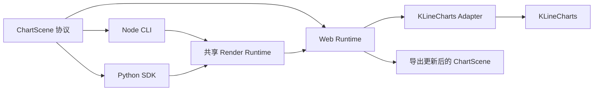

# Baron KLineCharts 场景平台设计

**日期：** 2026-07-24
**状态：** 方案已确认，待实施
**目标引擎：** KLineCharts 10.0.0
**取代：** 当前 Lightweight Charts fork、旧标注平台设计及其全部兼容约束

## 1. 决策摘要

本仓库将迁移为只支持 KLineCharts 的完整图表场景平台。

迁移完成后：

- 彻底删除 Lightweight Charts 源码、依赖、Primitive 适配和兼容 API。
- 不兼容旧 `AnnotationDocument`、旧 CLI、旧 Python API、旧包名和旧文档格式。
- 使用受控、版本化、纯数据的 `ChartScene` 作为 Web、CLI、Python、HTML 和 PNG
  之间的唯一交换协议。
- KLineCharts 负责 K 线、Pane、Y 轴、指标、Overlay、坐标换算、绘制、命中检测和
  官方交互能力。
- 本项目负责场景协议、严格校验、KLineCharts Adapter、跨语言 SDK、离线 HTML、
  确定性 PNG 和正式扩展治理。
- 场景文件只接受内嵌、已标准化的静态行情数据。
- 场景文件禁止任意 JavaScript、回调、网络数据源和运行时对象。
- 指标只保存配置，由 KLineCharts 在浏览器运行时计算；CLI 和 Python 不重复实现指标算法。
- Web 和离线 HTML 允许创建、修改、删除标注，并导出更新后的完整场景。
- 不提供撤销和重做能力。

## 2. 背景与问题

当前仓库源于 Lightweight Charts fork，历史上同时承担图表内核、线工具封装和公共包身份。
后续又开始建设独立标注协议、CLI、Python SDK 和无头渲染能力。

该路线需要自行长期验证以下底层能力：

- 图表核心版本同步和上游合并。
- 坐标换算、几何绘制与命中测试。
- 鼠标、触摸和文本交互。
- 多 Pane、多 Y 轴、指标和 Overlay 协作。
- 图表生命周期和资源释放。
- 浏览器兼容性、性能和视觉稳定性。

KLineCharts 已经提供完整 K 线、指标、Overlay、Pane、Y 轴、数据加载和移动端交互能力。
本项目不再继续验证和维护另一套图表底层，而是把工程价值集中到以下差异化能力：

- 一个可由多语言严格读写的完整图表场景协议。
- 一个隔离 KLineCharts 版本变化的受控 Adapter。
- Web、CLI、Python 和离线渲染共享的场景语义。
- 不依赖网络的 HTML 和确定性 PNG 输出。
- 对正式指标、Overlay 和样式扩展的版本治理。

## 3. 目标

### 3.1 产品目标

- 发布可嵌入 Web 应用的 KLineCharts 场景运行时。
- 发布可自包含运行的可编辑离线 HTML。
- 发布可校验、查询、修改和渲染场景的 Node CLI。
- 发布可构造、查询、修改和渲染场景的 Python SDK。
- Web、CLI、Python、HTML 和 PNG 使用同一份 `ChartScene`。
- 同一场景在固定 Runtime、KLineCharts、Chromium、字体和渲染参数下可复现。
- Web 和离线 HTML 中的标注修改可以导出为新的完整场景。

### 3.2 工程目标

- Schema 是跨语言唯一事实来源。
- Adapter 是唯一允许导入 `klinecharts` 类型的模块。
- KLineCharts 版本使用精确版本，不使用范围依赖。
- 所有导入、修改和导出都经过完整场景校验。
- HTML 和 PNG 使用同一份 Render Runtime。
- 初始化或渲染失败时不保留半成品状态和资源。
- 未知字段、未知类型和版本不匹配明确失败，不静默忽略。

## 4. 非目标

首版不包含：

- Lightweight Charts 兼容层或双引擎运行。
- 旧文档、旧包名、旧 CLI 或旧 Python API 的迁移器。
- REST、WebSocket、鉴权、交易所接入或网络行情加载。
- 将 KLineCharts `DataLoader`、回调或运行时对象序列化进场景。
- 在 CLI 或 Python 中重复实现 MA、MACD、RSI 等指标算法。
- 任意 JavaScript 自定义指标、Overlay、Formatter 或事件回调。
- 运行时插件下载、CDN 依赖或外部脚本注入。
- 撤销和重做。
- 将缩放、平移等临时会话操作自动写回场景。
- 多人协作、云存储或后端同步。
- 首版针对手写笔提供独立交互承诺。
- SVG 或 PDF 输出。

## 5. 设计原则

### 5.1 单引擎

KLineCharts 是唯一图表内核。

仓库不建设通用图表引擎接口，不维护另一套实现，也不在 KLineCharts 失败时切换到其他引擎。

### 5.2 协议只包含纯数据

`ChartScene` 必须可以被标准 JSON 编解码，并可以由 JSON Schema 完整验证。

以下内容禁止进入场景：

- 函数。
- JavaScript 源码。
- DOM 节点。
- KLineCharts 实例。
- Indicator 或 Overlay 运行时对象。
- `DataLoader`。
- 事件回调。
- 外部 URL。
- 鉴权信息。

### 5.3 能力受控开放

场景协议不一比一复制 KLineCharts 全部 TypeScript API。

每个被协议支持的指标、Overlay、样式和格式化策略必须满足：

- 有固定名称。
- 有固定输入字段。
- 有 JSON Schema。
- 有 TypeScript 类型。
- 有 Python 模型。
- 有 Adapter 实现。
- 有契约和渲染测试。

### 5.4 精确版本

场景记录精确 `engineVersion` 和 `runtimeVersion`。

Runtime 只加载与自身匹配的场景版本。版本不匹配时明确失败，不自动选择其他版本，也不静默迁移。

### 5.5 不依赖 KLineCharts 默认值

持久化场景保存完整、规范化后的配置。

运行时不依赖 KLineCharts 当前版本的隐式默认样式或默认行为，避免引擎升级造成未声明的场景变化。

## 6. 总体架构



### 6.1 职责分层

#### 场景装配职责

Web Runtime、CLI 和 Python SDK 分别负责各自使用场景中的入口、状态和副作用：

- Web Runtime 持有图表 DOM、工具栏、当前选择和宿主事件订阅。
- CLI 持有命令参数、stdout、stderr、退出码和文件写入。
- Python SDK 持有 Python 对象、异常和文件输出。

这些模块不直接解释 KLineCharts 内部对象。

#### 能力契约职责

`ChartScene` Schema 规定：

- 场景如何表达行情、Symbol、Period、Pane、Y 轴、指标、Overlay、样式和渲染参数。
- 每个字段的输入输出格式。
- 引用关系和版本约束。
- Web、CLI 和 Python 可以共同依赖的稳定语义。

#### 原子能力职责

KLineCharts Adapter 和 Render Runtime 提供具体能力：

- Adapter 将 `ChartScene` 编译为 KLineCharts 调用。
- Adapter 将当前 Overlay 状态转换回纯数据。
- Render Runtime 提供固定浏览器页面、字体加载、ready 协议和截图容器。

原子能力不理解 CLI 命令、Python 对象或具体宿主业务。

### 6.2 依赖方向

```text
Web Runtime ────────┐
CLI ────────────────┼──► ChartScene Schema
Python SDK ─────────┘

Web Runtime ───────────► KLineCharts Adapter ───────────► KLineCharts
Render Runtime ────────► Web Runtime
CLI Render ────────────► Render Runtime
Python Render ─────────► Render Runtime
```

禁止以下反向依赖：

- Schema 依赖 KLineCharts 类型。
- CLI 或 Python 依赖 KLineCharts 运行时对象。
- Adapter 依赖 CLI 或 Python。
- KLineCharts 配置对象成为跨语言公共协议。

## 7. 包与目录

目标工作区：

```text
lightweight-charts-pro/
├── package.json
├── packages/
│   ├── scene-schema/
│   ├── klinecharts-adapter/
│   ├── web-runtime/
│   ├── render-runtime/
│   └── cli/
├── python/
│   └── baron-klinecharts/
├── examples/
│   ├── vanilla/
│   ├── react/
│   ├── vue/
│   └── python/
└── tests/
    ├── fixtures/
    ├── contract/
    ├── browser/
    ├── rendering/
    ├── cross-language/
    └── installation/
```

建议公共包：

| 包 | 职责 | 发布 |
|---|---|---|
| `@baron/kline-scene-schema` | Schema、类型、严格校验器 | npm |
| `@baron/klinecharts-adapter` | 场景与 KLineCharts 双向转换 | npm |
| `@baron/klinecharts-runtime` | Web 创建、交互、事件和导出 | npm |
| `@baron/klinecharts-render-runtime` | 自包含渲染页面与 ready 协议 | 工作区内部 |
| `@baron/klinecharts-cli` | 场景命令和 HTML/PNG 渲染 | npm |
| `baron-klinecharts` | Python 场景 SDK 和渲染入口 | PyPI |

所有公共 npm 包使用同一版本组。

Python 包与 npm 版本保持一致。Schema 文档使用独立整数版本。

## 8. ChartScene 协议

### 8.1 顶层结构

```json
{
  "schema": "@baron/kline-scene",
  "version": 1,
  "runtime": {
    "engine": "klinecharts",
    "engineVersion": "10.0.0",
    "runtimeVersion": "1.0.0"
  },
  "symbol": {},
  "period": {},
  "data": [],
  "chart": {},
  "panes": [],
  "overlays": [],
  "viewport": {},
  "render": {},
  "metadata": {}
}
```

### 8.2 RuntimeIdentity

```ts
interface RuntimeIdentity {
  engine: 'klinecharts';
  engineVersion: string;
  runtimeVersion: string;
}
```

`engineVersion` 和 `runtimeVersion` 必须是精确版本。

### 8.3 Symbol

Symbol 至少包含：

- `ticker`
- `pricePrecision`
- `volumePrecision`

可选展示字段必须在 Schema 中明确声明，不允许任意扩展运行时行为。

### 8.4 Period

Period 保存：

- `span`
- `type`

`type` 使用受控枚举。禁止把接口请求参数或后端特有周期对象直接写入场景。

### 8.5 MarketData

```ts
interface MarketData {
  timestamp: number;
  open: number;
  high: number;
  low: number;
  close: number;
  volume?: number;
  turnover?: number;
}
```

规则：

- `timestamp` 是毫秒时间戳。
- `open`、`high`、`low`、`close` 必填。
- 所有数值必须有限。
- 行情必须按 `timestamp` 严格递增。
- 禁止重复时间。
- `volume` 缺失时保持缺失。
- `turnover` 缺失时保持缺失。
- 不允许用 `volume` 替代 `turnover`，也不允许反向替代。
- 场景中不保存加载状态、请求游标、订阅句柄或数据源 URL。

### 8.6 ChartConfig

`chart` 保存经过受控 Schema 声明的：

- locale
- timezone
- layout
- styles
- thousands separator 策略
- decimal fold 策略
- zoom anchor
- 预定义格式化模板

Formatter 只能使用枚举和纯数据参数，禁止函数。

### 8.7 Pane

Pane 使用稳定 ID：

```ts
interface ScenePane {
  id: string;
  kind: 'candle' | 'indicator';
  order: number;
  height: number;
  minHeight: number;
  state: 'normal' | 'maximize' | 'minimize';
  yAxes: SceneYAxis[];
  indicators: SceneIndicator[];
}
```

```ts
interface SceneYAxis {
  id: string;
  role: 'primary' | 'additional';
  position: 'left' | 'right';
  reverse: boolean;
  inside: boolean;
  scrollZoomEnabled: boolean;
  topGap: number;
  bottomGap: number;
}
```

Pane ID、Y 轴 ID、Indicator ID 和 Overlay ID 在各自作用域内必须唯一。

所有引用必须指向真实存在的对象。

场景必须且只能包含一个 `kind: 'candle'` 的主图 Pane。

每个 Pane 必须且只能包含一个 `role: 'primary'` 的 Y 轴。

KLineCharts 通过创建指标生成副图 Pane，因此每个 `kind: 'indicator'` 的 Pane 至少包含一个指标。
指标副图中至少一个指标必须引用该 Pane 的 primary Y 轴，并由 Adapter 优先创建。
首版不声明 KLineCharts 无法独立创建的空副图 Pane。

### 8.8 Indicator

Indicator 保存：

- 稳定 ID。
- KLineCharts 指标名称。
- Pane ID。
- Y 轴 ID。
- 计算参数。
- 精度和样式。
- 显示状态。

不保存指标计算结果。

首版正式支持 KLineCharts 10.0.0 内置指标：

- MA
- EMA
- SMA
- BBI
- VOL
- MACD
- BOLL
- KDJ
- RSI
- BIAS
- BRAR
- CCI
- DMI
- CR
- PSY
- DMA
- TRIX
- OBV
- VR
- WR
- MTM
- EMV
- SAR
- AO
- ROC
- PVT
- AVP

每个指标的参数长度、数值范围和 Pane 约束由 Schema 明确声明。

### 8.9 Overlay

Overlay 使用判别联合类型。

通用字段：

```ts
interface SceneOverlayBase {
  id: string;
  type: string;
  paneId: string;
  groupId?: string;
  visible: boolean;
  locked: boolean;
  zLevel: number;
  mode: 'normal' | 'weak_magnet' | 'strong_magnet';
  styles: SceneOverlayStyles;
  metadata?: JsonObject;
}
```

锚点按真实业务维度拆分，禁止为了复用同一结构而填充无意义字段：

```ts
interface SceneTimeAnchor {
  timestamp: number;
}

interface SceneValueAnchor {
  value: number;
}

interface SceneTimeValueAnchor {
  timestamp: number;
  value: number;
}
```

各 Overlay 判别分支显式选择自己的锚点：

- 垂直直线只保存 `SceneTimeAnchor`。
- 水平直线和价格线只保存 `SceneValueAnchor`。
- 水平射线和水平线段保存一个价格及两个决定横向范围或方向的时间。
- 垂直射线和垂直线段保存一个时间及两个决定纵向范围或方向的价格。
- 斜线、通道、矩形、箭头和斐波那契使用 `SceneTimeValueAnchor`。
- 文本和 Tag 根据工具语义选择时间价格锚点或价格锚点。
- Brush 使用有上限的 `SceneTimeValueAnchor` 数组。

首版正式支持 KLineCharts 10.0.0 内置 Overlay：

- `horizontalRayLine`
- `horizontalSegment`
- `horizontalStraightLine`
- `verticalRayLine`
- `verticalSegment`
- `verticalStraightLine`
- `rayLine`
- `segment`
- `straightLine`
- `priceLine`
- `priceChannelLine`
- `parallelStraightLine`
- `fibonacciLine`
- `brush`
- `simpleAnnotation`
- `simpleTag`

首版项目正式扩展：

- `rectangle`
- `arrow`
- `crossLine`
- `callout`
- `text`

工具特有字段使用固定 Schema：

- `text` 使用显式文本和排版字段。
- `rectangle` 使用起止点、stroke 和 fill。
- `callout` 使用 anchor、textAnchor、文本、线样式和文本样式。
- `fibonacciLine` 使用显式 levels。
- `brush` 使用受限点数组。

禁止使用 `extendData: any` 承载未声明字段或函数。

### 8.10 Viewport

Viewport 保存初始：

- 可见时间范围。
- bar space。
- 右侧 offset。
- 缩放锚点。

Web 中的平移和缩放只改变当前会话状态。

导出场景时保持原 `viewport`，不把临时交互状态写回。

### 8.11 RenderConfig

RenderConfig 保存：

- width
- height
- device scale factor
- background
- 固定字体选择
- 截图等待超时

字体只能引用 Render Runtime 内置并携带许可证的字体，不允许外部字体 URL。

### 8.12 Metadata

Metadata 只允许 JSON 值。

Metadata 不参与 KLineCharts 配置，不允许影响渲染、校验、指标计算或事件行为。

## 9. Schema 与规范化

### 9.1 唯一事实来源

JSON Schema 是协议唯一事实来源。

由 Schema 生成：

- TypeScript 类型。
- TypeScript standalone validator。
- Python 包内 Schema。
- Python 模型辅助代码。
- 契约 fixture 校验入口。

### 9.2 严格校验

Schema 使用：

- `additionalProperties: false`
- 判别联合。
- ID 格式约束。
- 数值范围约束。
- 数组上下限。
- 工具特有字段约束。

Schema 之外的跨对象约束由语义校验器完成：

- 唯一 ID。
- Pane 和 Y 轴引用。
- 时间排序。
- OHLC 合法关系。
- Indicator 与 Pane 的兼容性。
- Overlay 点数。
- Runtime 版本匹配。

### 9.3 规范化场景

持久化场景是完整规范化形式：

- 所有会影响渲染的默认值显式写入。
- 对象键顺序不属于语义。
- 数组顺序属于语义时必须稳定。
- 不保留未知字段。
- 不将无效值转换为空值、零值或其他字段值。

### 9.4 规范字节序列

结构校验、语义校验和默认值展开完成后，跨语言持久化使用 RFC 8785 JSON Canonicalization
Scheme 生成 UTF-8 字节：

- TypeScript 和 Python 使用同一标准的字符串转义、对象键排序和数字序列化规则。
- `timestamp` 等整数必须位于 IEEE 754 安全整数范围内；所有小数必须是有限双精度数。
- Web 导出、CLI JSON 输出、Python JSON 输出和 HTML 内嵌 Scene 都基于同一规范字节序列。
- 普通输入 JSON 的属性顺序不影响语义，但同一规范化 Scene 的持久化字节必须一致。
- HTML 和 PNG 的跨入口一致性测试使用规范 Scene 哈希识别输入。

## 10. KLineCharts Adapter

### 10.1 职责

Adapter 负责：

- 校验 Runtime 与 KLineCharts 版本。
- 将 Scene 配置转换为 KLineCharts API 调用。
- 维护 Scene Pane/Y 轴稳定 ID 与 KLineCharts 运行时 ID 的映射。
- 创建静态内存 DataLoader。
- 创建 Pane、Y 轴、Indicator 和 Overlay。
- 恢复初始 viewport。
- 将当前 Overlay 转换回 Scene Overlay。
- 把 KLineCharts 失败转换为稳定项目错误。
- 销毁 KLineCharts 和相关资源。

### 10.2 静态内存 DataLoader

场景不保存 `DataLoader`。

Adapter 内部创建只读取 `scene.data` 的 DataLoader：

- 初始化返回完整静态数据。
- 不发送网络请求。
- 不订阅实时数据。
- 不根据当前时间产生新数据。
- 不修改原场景数组。

### 10.3 Pane 与 Y 轴 ID 映射

Scene ID 是跨语言稳定 ID，KLineCharts ID 是浏览器运行时实现细节。

Adapter 创建时维护双向映射：

```text
Scene candle Pane ID  ─────► KLineCharts candle_pane
Scene indicator Pane ID ───► KLineCharts indicator Pane ID
Scene primary Y-axis ID ───► KLineCharts 实际默认 Y-axis ID
Scene additional Y-axis ID ► KLineCharts 显式创建的 Y-axis ID
```

规则：

- Scene 不保存 `candle_pane`、`x_axis_pane` 或引擎生成的 Y 轴 ID。
- Adapter 按规范 Scene 中 Pane 和 Y 轴的数组顺序生成确定性的内部运行时 ID，不使用随机 ID。
- Overlay 和 Indicator 的 `paneId`、`yAxisId` 先经过映射再传给 KLineCharts。
- 导出时不得把 KLineCharts 运行时 ID 写回 Scene。
- 主图默认 Y 轴在初始化后通过 `getYAxes` 读取并绑定到 Scene 主 Y 轴。
- 指标副图先用引用 primary Y 轴的首个指标创建 Pane 和主轴，再创建附加 Y 轴和其余指标。
- 映射缺失时返回 `INVALID_REFERENCE`，不默认选择其他 Pane 或 Y 轴。

### 10.4 正向转换

```text
完整校验 ChartScene
→ 校验 Runtime 与 Engine 精确版本
→ 初始化 KLineCharts
→ 设置 Symbol 和 Period
→ 注入静态行情
→ 创建 Pane 和 Y 轴
→ 创建 Indicator
→ 创建 Overlay
→ 恢复固定 Viewport
→ 发出 scene-ready
```

任何步骤失败都销毁已经创建的图表和资源。

### 10.5 反向转换

```text
读取当前 KLineCharts Overlay
→ 按正式类型白名单转换
→ 移除所有运行时字段和函数
→ 替换原 ChartScene.overlays
→ 保留行情、Pane、指标、样式和 Viewport
→ 完整重新校验
→ 输出规范化 ChartScene
```

导出过程中发现未知 Overlay 或不可序列化状态时整体失败，不部分导出。

### 10.6 扩展注册

正式扩展采用编译期注册表：

```ts
interface RegisteredOverlayDefinition {
  type: string;
  schemaId: string;
  registerWithKLineCharts(): void;
  toKLineCharts(overlay: SceneOverlay): KLineChartsOverlayCreate;
  fromKLineCharts(overlay: KLineChartsOverlay): SceneOverlay;
}
```

注册表随 Runtime 发布，不支持运行时下载或注入。

## 11. Web Runtime

### 11.1 公共 API

```ts
const runtime = await createKLineSceneRuntime({
  container,
  scene,
});

runtime.getScene();
runtime.exportScene();

runtime.startOverlayDrawing({ type: 'segment', id: 'line-1' });
runtime.addOverlay(overlay);
runtime.updateOverlay(id, patch);
runtime.removeOverlay(id);
runtime.getOverlay(id);
runtime.listOverlays(filter);

runtime.subscribe(listener);
runtime.destroy();
```

Runtime 不公开原始 KLineCharts 实例。

### 11.2 事件

首版事件：

- `scene-ready`
- `overlay-created`
- `overlay-updated`
- `overlay-removed`
- `overlay-selected`
- `scene-error`

事件只包含纯数据。

宿主业务根据稳定 ID 在场景之外绑定行为。

### 11.3 编辑范围

Web Runtime 允许：

- 创建 Overlay。
- 选择 Overlay。
- 拖动 Overlay。
- 修改 Overlay。
- 删除 Overlay。
- 导出更新场景。

Web Runtime 不维护撤销栈或重做栈。

Web 交互不隐式修改：

- 行情。
- Symbol。
- Period。
- Pane。
- Y 轴。
- Indicator。
- 样式。
- Viewport。

### 11.4 生命周期

`destroy()` 必须释放：

- KLineCharts 实例。
- DOM。
- Runtime 监听器。
- 工具栏监听器。
- 文本输入覆盖层。
- 订阅者。
- 临时对象 URL。

## 12. 离线 HTML

HTML 产物是单文件、自包含、可编辑场景：

- 内嵌固定 KLineCharts。
- 内嵌 Web Runtime。
- 内嵌正式扩展。
- 内嵌字体和字体许可证。
- 内嵌完整 ChartScene。
- 不依赖 CDN。
- 不发送网络请求。
- 不加载外部脚本。

标准工具栏至少提供：

- Overlay 工具选择。
- 当前选择删除。
- 导出完整场景。
- 图表平移和缩放。

离线 HTML 导出的 JSON 必须通过完整场景校验。

用户文本使用数据通道和安全 DOM API，不通过 `innerHTML` 拼接。

## 13. CLI

目标命令名：`baron-kline`。

### 13.1 校验和查看

```bash
baron-kline validate scene.json
baron-kline inspect scene.json --json
```

### 13.2 Overlay

```bash
baron-kline overlays list scene.json --json
baron-kline overlays get scene.json --id line-1
baron-kline overlays add scene.json --input overlay.json --output result.json
baron-kline overlays replace scene.json --id line-1 --input overlay.json --output result.json
baron-kline overlays remove scene.json --id line-1 --output result.json
```

### 13.3 Indicator

```bash
baron-kline indicators list scene.json --json
baron-kline indicators add scene.json --input indicator.json --output result.json
baron-kline indicators replace scene.json --id macd-1 --input indicator.json --output result.json
baron-kline indicators remove scene.json --id macd-1 --output result.json
```

### 13.4 渲染

```bash
baron-kline render scene.json --format html --output chart.html
baron-kline render scene.json --format png --output chart.png
baron-kline install-browser
```

### 13.5 CLI 规则

- JSON 查询结果输出到 stdout。
- 错误 JSON 输出到 stderr。
- 错误使用非零退出码。
- 修改命令要求 `--output`。
- 输出文件存在时返回 `OUTPUT_EXISTS`。
- 只有显式 `--force` 才允许覆盖确切输出文件。
- 写入使用同目录临时文件和原子替换。
- 不在失败时留下部分输出。

## 14. Python SDK

目标发行名：`baron-klinecharts`。
目标导入名：`baron_kline`。

### 14.1 场景 API

```python
from baron_kline import ChartScene, Segment

scene = ChartScene.from_json("scene.json")

scene.overlays.add(
    Segment(
        id="line-1",
        pane_id="candle",
        points=[...],
    )
)

scene.to_json("result.json")
scene.render_html("chart.html")
scene.render_png("chart.png")
```

### 14.2 输入

行情输入支持：

- JSON。
- CSV。
- `list[dict]`。
- 可选 pandas `DataFrame`。

调用方必须显式提供字段映射。

SDK 不猜测相似列名，不用其他列替代缺失列。

### 14.3 Python 职责边界

Python SDK 可以：

- 构造和校验场景。
- 查询和修改 Pane、Y 轴、Indicator 和 Overlay 配置。
- 导出 JSON。
- 渲染 HTML 和 PNG。

Python SDK 不计算 KLineCharts 指标结果。

## 15. Render Runtime

### 15.1 共享运行时

Node CLI 和 Python 使用同一份版本化浏览器 Render Runtime。

Python 包内嵌与其版本匹配的 Render Runtime 静态产物，不调用外部 Node CLI。

### 15.2 HTML

HTML 使用同一 Render Runtime 生成，不重新实现 Adapter。

### 15.3 PNG

PNG 流程：

```text
校验完整 ChartScene
→ 启动固定 Playwright Chromium
→ 加载本地 Render Runtime
→ 注入 ChartScene
→ 等待字体加载
→ 等待 scene-ready
→ 固定 viewport、DPR 和尺寸
→ 截取图表区域
```

固定：

- Chromium 版本。
- viewport。
- device scale factor。
- 图表尺寸。
- 字体。
- locale。
- timezone。
- Runtime。
- KLineCharts。

### 15.4 浏览器缺失

浏览器未安装时：

- CLI 返回 `BROWSER_NOT_INSTALLED`。
- Python 抛出同错误码异常。
- 错误中给出明确安装命令。
- 不改用系统 Chrome、Safari 或其他浏览器。

## 16. 错误模型

首版错误码：

- `SCENE_SCHEMA_INVALID`
- `SCENE_VERSION_UNSUPPORTED`
- `ENGINE_VERSION_MISMATCH`
- `INVALID_MARKET_DATA`
- `DUPLICATE_ID`
- `UNKNOWN_INDICATOR`
- `UNKNOWN_OVERLAY`
- `INVALID_REFERENCE`
- `RUNTIME_INIT_FAILED`
- `EXPORT_INVALID`
- `BROWSER_NOT_INSTALLED`
- `RENDER_TIMEOUT`
- `OUTPUT_EXISTS`
- `FILE_IO_ERROR`

错误对象至少包含：

```ts
interface BaronKLineError {
  code: string;
  message: string;
  path?: string;
  details?: JsonValue;
  cause?: unknown;
}
```

错误规则：

- 用户可修复错误提供稳定 path。
- KLineCharts 原始异常作为 cause 保留。
- 公共错误消息不泄漏绝对路径或敏感信息。
- 不把错误转换为空数组、空对象、`false` 或成功状态。

## 17. 测试设计

### 17.1 Schema 契约

覆盖：

- 每种 Indicator。
- 每种 Overlay。
- Pane 和 Y 轴。
- ChartConfig。
- RenderConfig。
- RuntimeIdentity。
- 所有合法和非法 fixture。

重点非法场景：

- 重复时间。
- 重复 ID。
- 非法 OHLC。
- 未知类型。
- 错误 Pane 或 Y 轴引用。
- 非法点数。
- 非法样式。
- Engine 或 Runtime 版本不匹配。
- 回调、函数或未知字段。

### 17.2 Adapter 契约

使用真实 KLineCharts：

- `ChartScene → KLineCharts → exportScene` 语义 round-trip。
- 内置指标创建。
- 内置 Overlay 创建和读取。
- 项目正式扩展创建和读取。
- 静态行情注入。
- Viewport 恢复。
- 未知运行时对象拒绝导出。
- KLineCharts 内部字段和函数不泄漏到 JSON。

### 17.3 浏览器交互

Playwright 覆盖：

- 创建 Overlay。
- 选择 Overlay。
- 拖动和修改 Overlay。
- 删除 Overlay。
- 导出完整场景。
- 鼠标。
- 移动端触摸。
- 平移和缩放。
- 中文文本输入。
- 离线 HTML。
- 重复创建和销毁。

首版不单独承诺手写笔优化。

稳定版发布前必须完成真实 iOS Safari 和 Android Chrome 验收。

### 17.4 渲染

- 固定 Chromium、viewport、DPR、字体、locale 和 timezone。
- 主要 K 线样式建立 PNG 基线。
- 所有内置指标至少进入一组视觉 fixture。
- 所有 Overlay 至少进入一组视觉 fixture。
- HTML 和 PNG 使用同一 Scene fixture。
- 未收到 `scene-ready` 时禁止截图。

### 17.5 跨语言

```text
Python 创建 Scene
→ CLI 修改 Overlay
→ Web 加载并编辑
→ Web 导出
→ Python 重新读取
→ CLI 和 Python 分别生成 HTML 和 PNG
```

验证：

- 完整语义一致。
- 所有 ID 和引用稳定。
- 缺失字段不被其他字段替代。
- 不要求 JSON 属性顺序一致。
- 同一规范化 Scene 的 RFC 8785 字节和哈希一致。
- 在同一固定测试主机上，CLI 与 Python 生成的 HTML 和 PNG 字节一致。

### 17.6 发布安装

- `npm pack` 内容检查。
- Python wheel 和 sdist 内容检查。
- 全新临时项目安装。
- ESM 和 TypeScript declarations 导入。
- CLI 可执行文件。
- Python 导入。
- Render Runtime 内嵌资源。
- LICENSE、NOTICE 和 attribution。
- 生产依赖安全审计。

### 17.7 生命周期

连续创建和销毁 Runtime 后验证：

- 无遗留 KLineCharts 实例。
- 无遗留 DOM。
- 无遗留监听器。
- 无遗留文本输入层。
- 无遗留对象 URL。
- 无遗留浏览器进程。

## 18. 版本治理

### 18.1 固定版本

- 所有 npm 包固定 KLineCharts 10.0.0。
- 不使用 `^` 或 `~`。
- Runtime、Adapter 和 Render Runtime 使用固定版本组。
- Python 内嵌同版本 Render Runtime。

### 18.2 KLineCharts 升级

升级必须：

1. 显式修改精确依赖版本。
2. 审查 KLineCharts changelog 和类型差异。
3. 修改 Adapter。
4. 更新 Scene 版本或 Runtime 约束。
5. 运行 Schema、Adapter、浏览器、视觉、跨语言和安装测试。
6. 完成真实移动设备验收。

不自动升级，不保留旧 KLineCharts 作为降级运行时。

### 18.3 场景升级

首版不提供旧格式迁移。

未来如需支持 Scene v1 到 v2：

- 使用显式迁移命令。
- 输入和输出都完整校验。
- 不在普通加载流程中静默迁移。

## 19. 安全与许可证

### 19.1 安全

- 场景禁止可执行代码。
- HTML 不拼接用户文本为可执行内容。
- Render Runtime 不访问网络。
- 不允许 Scene 指定文件路径、脚本路径或字体 URL。
- 输出路径由调用方显式指定。
- 不覆盖未明确指定的文件。

### 19.2 许可证

发布产物必须包含：

- 本项目 LICENSE。
- 本项目 NOTICE。
- KLineCharts LICENSE 和 NOTICE 要求。
- KLineCharts 包含的上游 attribution。
- 内嵌字体许可证。
- Playwright 和浏览器相关许可信息。

## 20. 迁移边界

本次是替换，不是兼容迁移。

实施阶段将删除：

- Lightweight Charts fork 源码。
- Lightweight Charts 构建、测试和网站代码。
- `lightweight-charts` 依赖。
- Primitive API。
- 旧 line-tools wrapper。
- 旧 annotations 包。
- 旧 Schema。
- 旧 CLI。
- 旧 Python API。
- 旧跨语言 fixture。
- 已被本设计取代的旧方案和计划。

不会实现：

- 旧 JSON 到新 ChartScene 转换。
- 旧包名 re-export。
- 旧方法别名。
- 旧 CLI 命令别名。
- 旧 Python 类兼容。

## 21. 发布门禁

```text
lint 和 typecheck
→ Schema 生成与契约校验
→ Adapter 真实 KLineCharts 契约测试
→ Web Runtime 单元测试
→ Playwright 浏览器交互
→ PNG 视觉基线
→ Python 单元测试
→ 跨语言 round-trip
→ npm pack、wheel 和 sdist
→ 全新项目安装
→ LICENSE、NOTICE 和 attribution
→ 生产依赖审计
→ 真实 iOS Safari 和 Android Chrome 验收
```

任一门禁失败时不得发布稳定版。

## 22. 完成标准

满足以下条件才视为迁移完成：

- 仓库不存在 Lightweight Charts 源码、依赖或导入。
- 只存在 KLineCharts 单引擎实现。
- ChartScene Schema 覆盖行情、Symbol、Period、Pane、Y 轴、指标、Overlay、样式、
  Viewport 和 RenderConfig。
- Web Runtime 可以加载、编辑标注并导出完整场景。
- 离线 HTML 可以无网络运行、编辑标注并导出场景。
- CLI 可以校验、查询、修改并生成 HTML 和 PNG。
- Python 可以构造、查询、修改并生成 HTML 和 PNG。
- 指标只由 KLineCharts 计算。
- HTML 和 PNG 使用同一 Render Runtime。
- 所有错误都使用稳定错误码。
- 所有发布门禁通过。
